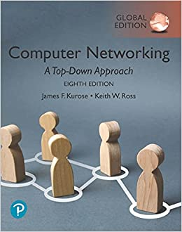

# CS-340 Intro to Computer Networking

## 개요
Northwestern 대학에서 2020년 가을에 EECS (Electrical Engineering and Computer Science) 전공 과목으로 열린 네트워크 강의.

이 강의를 수강하면서 배운 내용을 여기에 정리한다.

## 교재

Computer Networking: A Top-Down Approach

## 링크
[유튜브 강의](https://www.youtube.com/playlist?list=PLWl7jvxH18r3nnotitKkyAjq268PQGc0-)

[리소스](https://stevetarzia.com/teaching/)