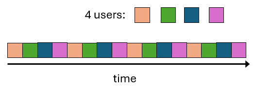

# 심플한 Communication Link 모델 - What's Communication Link in a high level
Communication Link란:
- **Bi-directional, point-to-point connection**
- 0, 혹은 1 전송을 허용한다. (그렇지 않으면 해당 Communication Link는 *idle* 상태가 된다 - 아무것도 전송하지 않음)
- Propagation delay: 하나의 End system에서 연결된 또 다른 End system으로 bit를 보낼 때, 전송되는 시간 (빛의 속도보다 빠를 수 없다) - **Link latency**
- 일정한 속도로 전달된다. (Bit per seconds) - **Link throughput** 이 속도는 Link 기술에 따라 달라진다.

# Circuit Switching
Circuit Switching Networking이란, 두 End system이 서로 통신할 때, 두 End system을 연결하는 경로가 세우는 방식의 Networking이다. 이때, 두 End system을 연결하는 데 사용된 각 channel은 연결이 지속되는 동안 다른 연결이 끼어들지 못한다.

위 그림을 보면 네 개의 Switch가 있고 각 Switch는 각각 4개의 virtual channel로 연결되어 있다. Endpoint 1과 Endpoint 4가 주황색 선으로 연결되어 있는데, 이 연결에서 Switch 1-Switch 2 사이의 채널과 Swtich 2-Switch 4 사이의 채널이 각각 하나씩 사용되고 있다. 그러면 Endpoint 1과 Endpoint 4 사이의 연결이 끊어질 때까지 해당 채널은 다른 연결이 사용할 수 없다. 이 때문에 제한된 수의 사용자만 Circuit Switching Network를 이용할 수 있다.

## Time division multiplexing (TDM)
물리적 연결이 여러 개의 virtual channel로 나뉘어 사용될 수 있다. 이는 Time division multiplexing에 의해 실현되는데, Time division multiplexing이란 시간을 일정한 간격으로 나누고, 각 virtual channel은 각자 할당받은 시간 간격 동안 연결이 유지되는 방식이다.

위 그림을 보면 주황색, 초록색, 남색, 자주색으로 표현되는 4개의 channel이 있고, 각 channel은 각각 link 사용 시간을 할당받아 연결을 유지한다.

# Packet Switching Networking
Packet Switching Networking은 전송할 데이터를 Packet이라는 단위의 작은 데이터 조각으로 나눈 다음에 각 Packet을 목적지로 전송하는 방식이다. Packet은 목적지에 도달할 때까지 여러 *hop* (steps)을 거치는데, 각 hop에서 Packet의 다음 hop, 혹은 목적지까지의 최적화된 경로를 선정하여 Packet을 전송한다.

[홉이란?](https://ko.wikipedia.org/wiki/%ED%99%89_(%EB%84%A4%ED%8A%B8%EC%9B%8C%ED%81%AC))

Circuit Switching과 가장 큰 차이점은 Packet Switching은 송신자와 수신자 사이의 연결을 *점유*할 필요가 없다는 점이다.

중간 단계의 라우터에서 Packet은 FIFO Queue에 저장되어 다음 hop으로 전송될 때까지 대기한다. 각 hop에서 다음으로 전송될 hop이 정해지기 때문에 Circuit Switching Networking보다 더욱 동적이다.

# Router
Router는 두 가지 역할을 한다.
- 최적의 경로를 찾기 위한 분산 라우팅 알고리즘
- Packet forwarding

## Queueing delay와 loss
Packet이 라우터에 도달하면 Packet은 처리될 때까지 Queue에 대기한다. Packet이 Queue에서 대기하는 시간은 Latency로 계산된다.

라우터의 Queue는 제한된 크기를 가지기 때문에 Queue가 꽉 찰 수 있다. Queue가 꽉 찬 상태에서 추가로 도달하는 Packet은 그대로 버려진다.

Internet에서 Packet 전달은 보장되지 않는다. (TCP가 이 문제를 해결해 준다)

## Packet delay의 4가지 요소
Packet delay는 다음 4가지 요소의 합으로 결정된다.
- Nodal processing delay
- Queueing delay
- Transmission delay
- Propagation delay

### Nodal processing delay
Router로 들어오는 Packet을 처리할 때 발생하는 지연이다.
- Bit 에러 체크
- Output link 결정 - Packet을 어디로 보낼지 결정하는 과정으로, Lookup table을 조회해야 함
- 일반적으로 ms보다 짧다

### Queueing delay
Output link에서 전송을 기다리는 동안 발생하는 지연. Outbound link의 혼잡도에 따라 달라진다.

### Transmission delay
Packet을 전송하는 데 걸리는 시간.

transmission delay = packet size (bits) / link bandwidth (bps)

### Propagation delay
Packet이 Link를 타고 목적지까지 전달되는 데 걸리는 시간

link의 길이 / 빛의 속도

# Internet은 Network의 Network이다.
어떻게 모든 지역 ISP를 연결할 수 있을까?

## Option 1. 모든 노드들을 1대1 연결

이 경우 두 가지 문제가 발생하는데,
- N^2 connection 필요
- 미국에 있는 모든 대학과 한국에 있는 모든 대학을 연결한다고 할 때, (미국에 있는 대학의 수) * (한국에 있는 대학의 수) 만큼 태평양 너머 연결되어야 한다.
  
## Option 2. Global "Tier 1" ISP

하나의 Global Tier 1 ISP를 두고 모든 ISP가 이 거대한 ISP에 연결되도록 하는 것이다. 이 경우 발생할 수 있는 문제가, 네트워크에 참여하는 모든 사용자가 이 하나의 ISP를 사용하는 데 "동의"하여야 한다는 것이다.

## Option 3. 여러 개의 Tier 1 ISP

전세계적으로 여러 개의 ISP를 두고, 각 Local ISP는 가까운 Tier 1 ISP로 연결되도록 하는 것이다.

그러나 위 그림을 보면 Tier 1 ISP끼리 연결되어 있지 않다.

IXP와 Peering link를 도입하여 Tier 1 ISP끼리 연결되도록 한다.
- IXP (Internet Exchange Point): 하나의 location에서 복수의 Tier 1 ISP가 연결되도록 중개하는 Point
- Peering link: Tier 1 ISP끼리 직접 연결하는 Link

## Final Option. Regianl ISP와 Content Provider

## Internet의 구조

Access ISP가 또한 Tier-1 ISP가 될 수 있다.

# Network layers
네트워크는 layered architecture로 디자인되어 있다. 여러 개의 Layer와 Protocol은 각각의 문제 영역을 다루고 있다.

## Protocol의 종류

### HTTP
- 웹 페이지, 이미지 Get
- 데이터를 서버로 Post
- URL, redirection, caching, proxies, cookies를 다룸

### TLS
트래픽 암호화 (optional, 그러나 오늘날 거의 쓰임)

### TCP
신뢰성 있는 데이터 흐름 제공 - ordering, delivery confimation, pacing

- 네트워크 연결에 대해 file-like 인터페이스 제공 (read and write byte[])
- 제한된 Packet 크기, dropped & reordered Packet을 다룸

### IP
여러 hop으로 Packet을 전송

### Eternet/Wi-Fi
여러 local device가 동일한 communication link를 공유할 수 있는 물리적인 해결 제공

## Packet Header
각 Layer는 Packet에 header를 담는다.

- Ethernet Packet = Ethernet Header + Ethernet Payload
- Ethernet Paylod = IP Packet = IP Header + IP Payload
- IP Payload = TCP Packet = TCP Header + TCP Payload
- TCP Payload = HTTP Packet = HTTP Header + HTTP Payload

### Header의 예시
#### Ethernet Header
- MAC address: 장치의 MAC 주소
- CRC

#### IP Header
- IP address
- TTL: Time-to-live

#### TCP Header
- Port number
- sequence number
- ack number

#### HTTP Header
- URL
- Content-Type
- Date

# Socket
Socket은 네트워크 연결의 추상화이다. 지금으로서는 Socket이란 프로그램에 의해 생성된 네트워크 연결이라고 이해한다.

- 각 컴퓨터는 고유한 IP 주소를 가지고 있다.
- 그러나 각 머신에는 수많은 프로세스가 작동하고 있다. 각 프로세스는 자신만의 network connection을 가지고 있다.
- 각 TCP, UDP Packet은 16-bit의 port 번호를 가지고 있다.
- OS가 Port를 관리한다. 하나의 port에 대해 오직 하나의 프로세스만 "listen"할 수 있다.

## Previleged ports
1024 미만의 port를 previleged port라 하며, previleged port를 사용하고자 한다면 OS가 root 혹은 관리자 권한을 요구할 것이다.

# TCP
인터넷은 Packet Switching 방식으로 데이터 통신이 이루어진다. 두 End system 사이에 어떠한 연결도 없고, Packet의 경로는 각 hop에서 동적으로 결정된다. Packet은 각 hop에서 다음 hop으로 보내지기 전에 Queue에서 대기하고, 네트워크 상황에 따라 Queue에 대기하는 시간은 달라진다. 이 때문에 목적지까지 Packet이 순서대로 도착할 것이란 보장은 없다.

이러한 상황에서 TCP는 데이터 전송을 위한 bidrectional, reliable **pipe**라는 추상화를 제공한다.

TCP는 다음 역할을 수행한다.
- Packet 순서 보장
- 소실된 Packet이 있을 경우, Packet 재전송 및 재조립
- Flow control: 송신자의 메시지 송신 제어
- Congestion control: 네트워크가 과부하 상태라면 송신을 막음

TCP가 작동될 때 먼저 3-way handshake를 통해 연결이 성립되어야 한다.

TCP의 단점은 다음과 같다.
- Client와 Server 사이에 먼저 연결이 만들어져야 한다.
- No timing or minimum throughput guarantees
- Lacks encryption